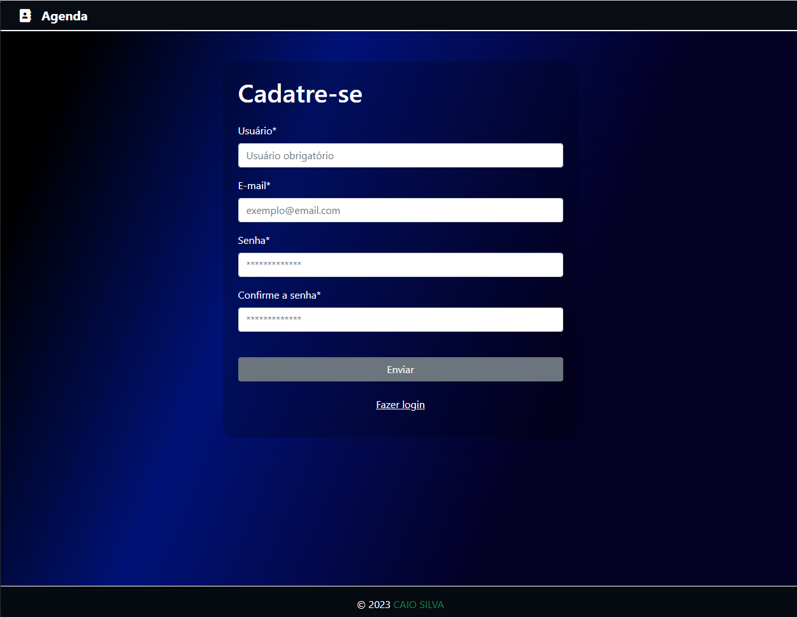
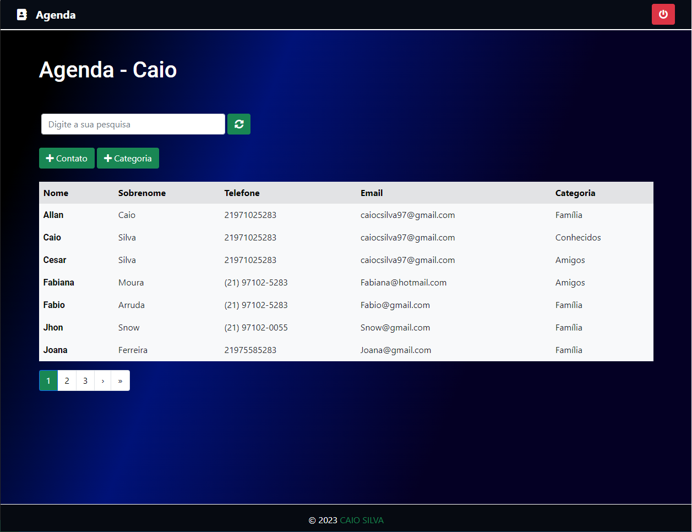
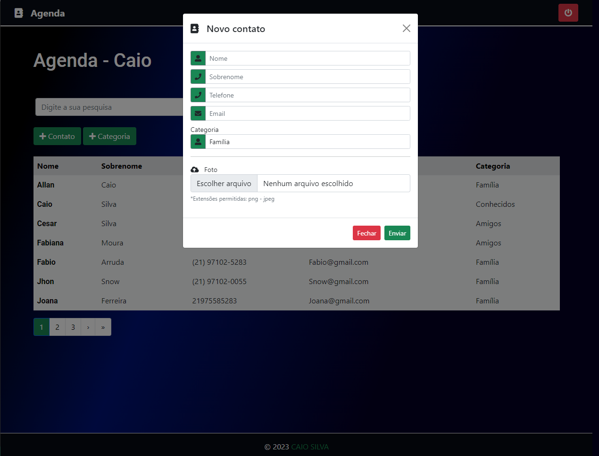
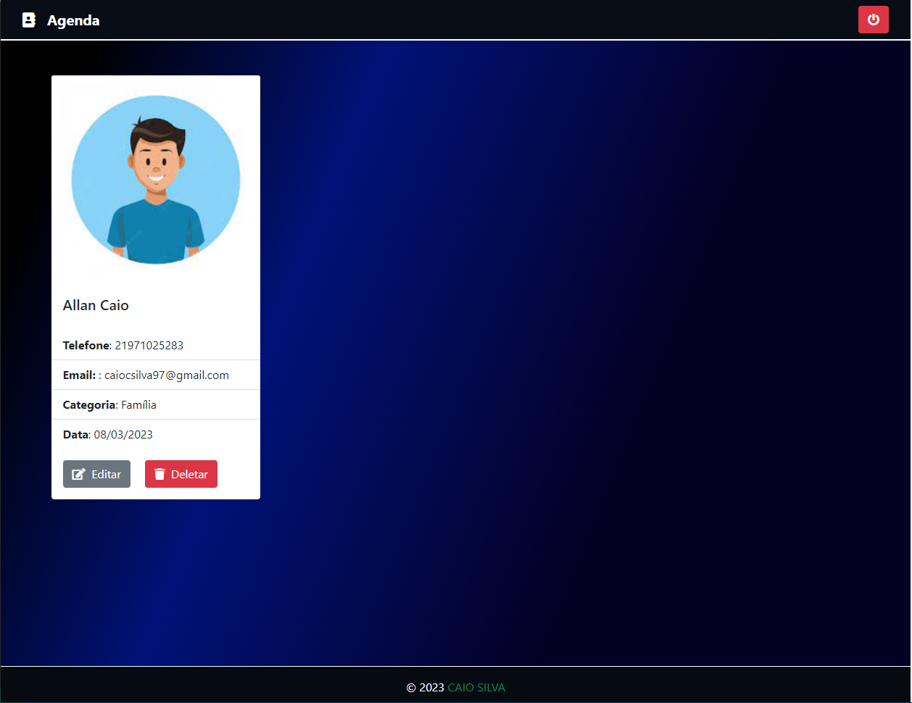

<div align="center" id="top"> 
  

</div>

<div align="center"> 
  <h1 align="center">AGENDA PESSOAL</h1>
</div>

<p align="center">
  
  
  
</p>

<p align="center">
  <a href="#sobre">Sobre</a> &#xa0; | &#xa0; 
  <a href="#funcionalidades">Funcionalidades</a> &#xa0; | &#xa0;
  <a href="#tecnologias">Tecnologias</a> &#xa0; | &#xa0;
  <a href="#requisitos">Pré requisitos</a> &#xa0; | &#xa0;
  <a href="#licença">Licença</a> &#xa0; | &#xa0;
  <a href="https://github.com/caiosilva23" target="_blank">Autor</a>
</p>


<p align="center">
  
  
  
  
  
</p>


<h2 id="sobre">
## 🎯 Sobre
</h2>


O projeto desenvolvindo para para gerenciar uma lista de contatos, com amplas funcionaliades, bem como autenticação.

<h2 id="sobre">
## ✨ Funcionalidades
</h2>


✔️ Autenticação de Usuário;\
✔️ Cadastro Usuário;\
✔️ Login/Logout;\
✔️ CRUD de Contatos;\
✔️ CRUD de Categoria;\
✔️ Filtro completo;\
✔️ Paginação;\


## 🚀 Tecnologias

As seguintes ferramentas foram usadas na construção do projeto:

- [Python](https://www.python.org/)
- [Django](https://nodejs.org/en/)
- [SQLite](https://www.sqlite.org/index.html)
- [Bootstrap](https://getbootstrap.com/)


<h2 id="requisitos">
## ✅ Pré requisitos
</h2>


Antes de começar 🏁, você precisa ter o [Python](https://www.python.org/downloads/) instalado em sua maquina.

## 🏁 Começando
1 - Primeiro clone o repositório e entre na pasta do projeto.

```bash
# Clone este repositório
$ git clone https://github.com/CaioSilva23/agenda.git

# Entre na pasta
$ cd agenda
```

2 - Segundo inicie um ambiente virtual

```bash
# Criar
  # Linux
    $ python3 -m venv venv
  # Windows
    $ python -m venv venv

#Ativar
  # Linux
    $ source venv/bin/activate
  # Windows
    $ venv/Scripts/Activate

# Caso algum comando retorne um erro de permissão execute o código e tente novamente:

  $ Set-ExecutionPolicy -Scope CurrentUser -ExecutionPolicy RemoteSigned
```

3 - Instale as dependências

```bash
# Instale as dependências
# Linux
$ pip3 install -r requirements.txt
# Windows
$ pip install -r requirements.txt
```

4 - Faça as migrações.
```bash
# Linux
python3 manage.py migrate
# Windows
python manage.py migrate
```

5 - Inicie a aplicação
```bash
# Para iniciar o projeto
# Linux
$ python3 manage.py runserver
# Windows
$ python manage.py runserver
```


<h2 id="requisitos">
## 📝 Licença
</h2>

Este projeto está sob licença MIT. Veja o arquivo [LICENSE](LICENSE) para mais detalhes.

Desenvolvido por <a href="https://github.com/caiosilva23" target="_blank">Caio Silva</a>

&#xa0;

<a href="#top">Voltar para o topo</a>
